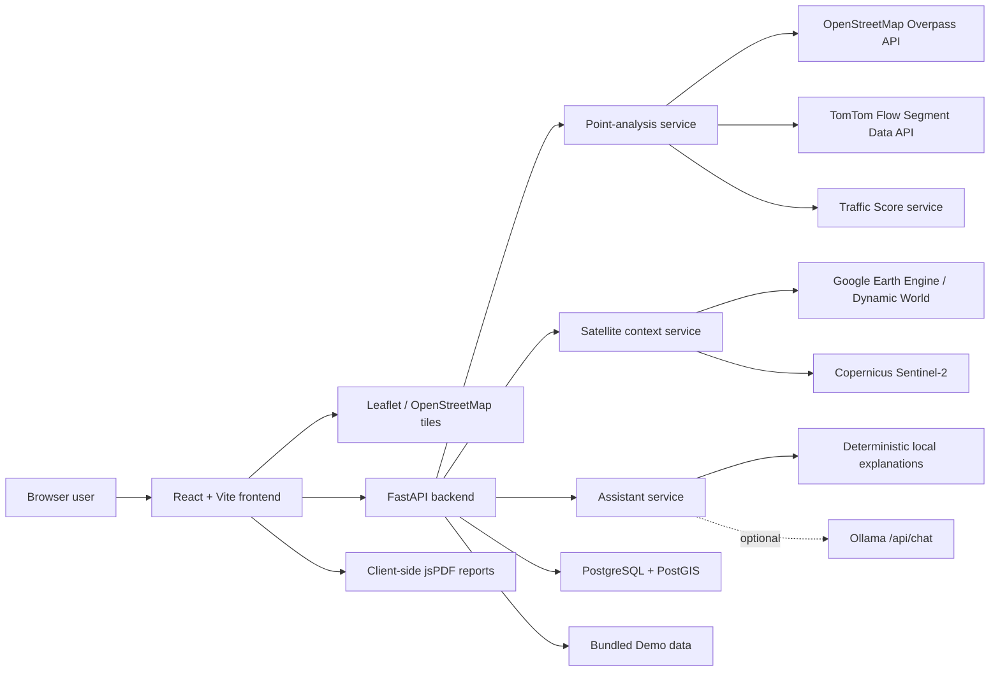
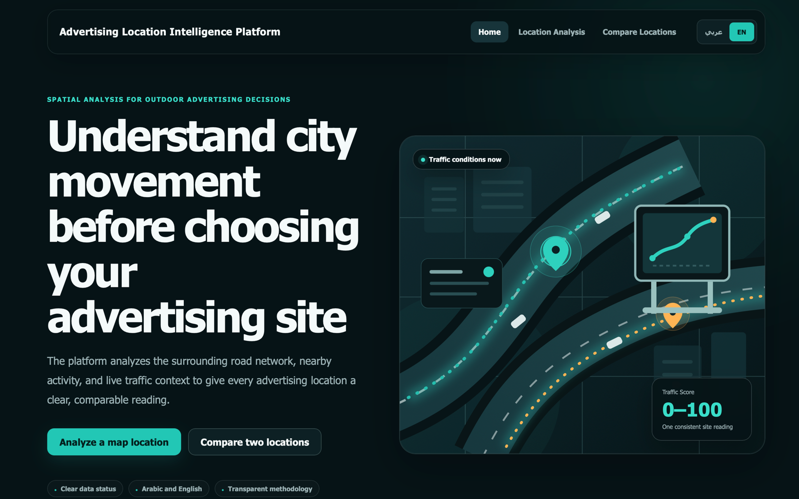
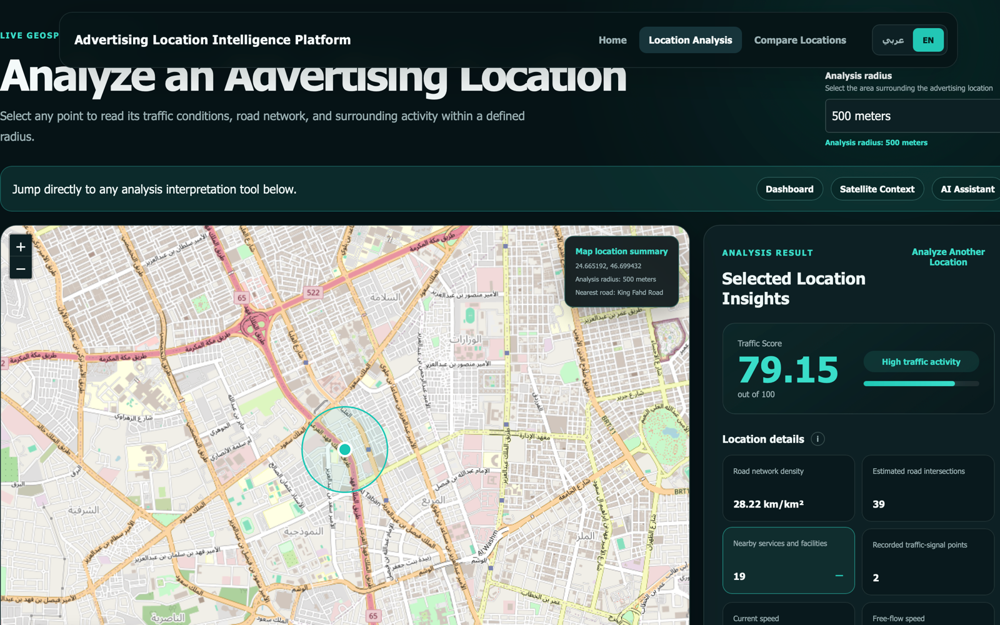
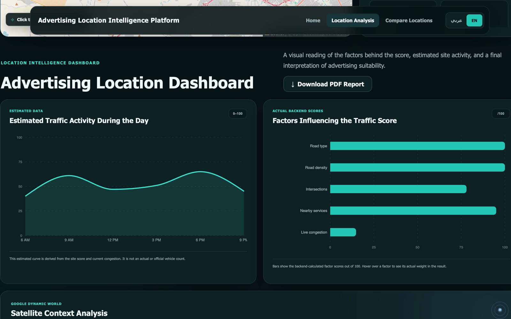
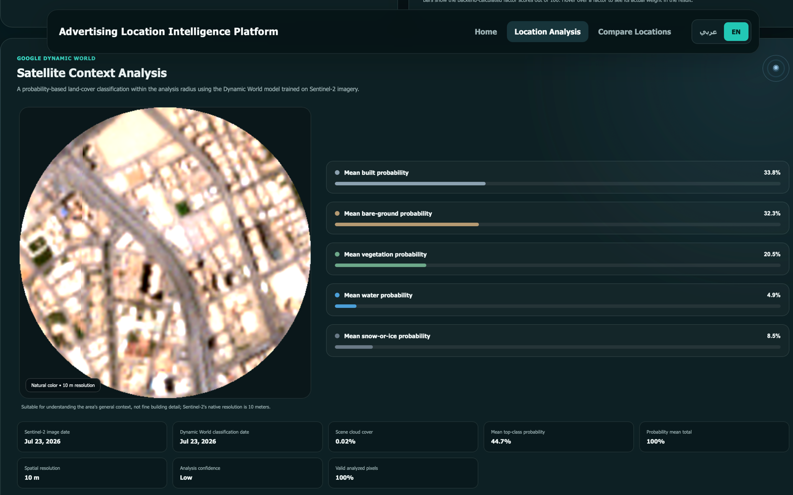
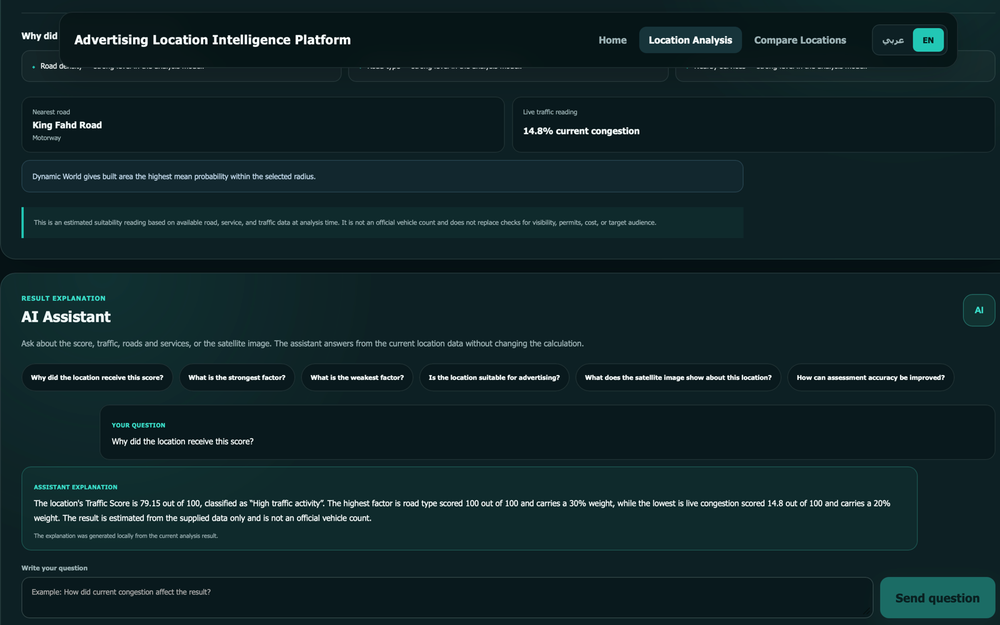
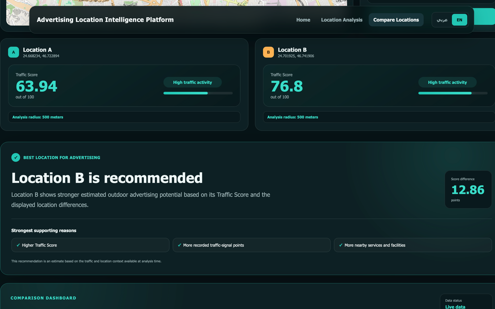
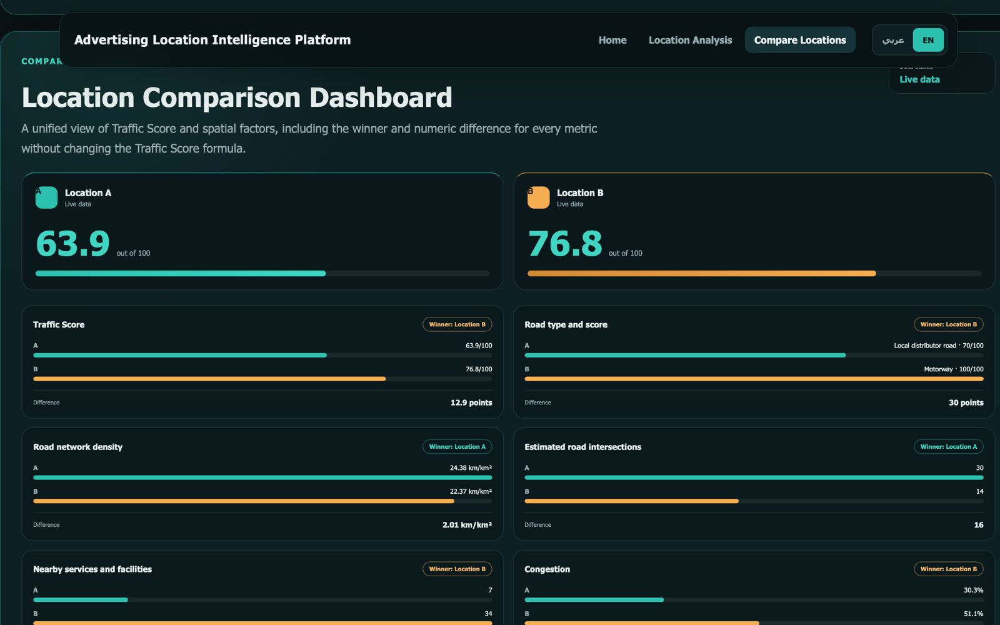

# ASWAR Traffic Intelligence

ASWAR Traffic Intelligence is a bilingual geospatial decision-support platform for evaluating and comparing outdoor advertising locations. It combines road-network characteristics, nearby activity, live traffic conditions, and satellite-derived land-cover context in an interactive web application.

The platform supports Arabic and English, Live and Demo runtime modes, single-location analysis, side-by-side location comparison, explanatory assistant responses, dashboards, and client-side PDF reports.

> Satellite imagery and assistant explanations provide contextual insight only. They do not modify the Traffic Score or its calculation weights.

## Project Description

ASWAR helps a user inspect an outdoor advertising location by selecting a point on a Leaflet map or entering coordinates manually. The user chooses an analysis radius of 250, 500, 750, 1,000, or 2,000 meters; 500 meters is only the initial UI suggestion.

For an arbitrary map point, the FastAPI backend requests OpenStreetMap and TomTom data in parallel. It derives spatial metrics, reads the current traffic state, and calculates a Traffic Score when both required sources are available. Satellite context and assistant explanations are requested separately so that their failure does not remove the core traffic result.

The repository also contains database-backed endpoints for ranking, summarizing, and comparing stored locations. These endpoints can incorporate an official 24-hour vehicle count when one exists in PostgreSQL.

## Objective

The project is intended to:

- make outdoor advertising location assessment easier to inspect and compare;
- present the factors behind a Traffic Score instead of returning an unexplained number;
- combine traffic, road-network, service, and land-cover context without mixing their responsibilities;
- preserve a clear distinction between live observations, stored official counts, estimates, and Demo Mode samples;
- provide a bilingual, responsive interface for desktop and mobile use;
- continue returning explicit partial or unavailable states when an external provider fails.

It is a decision-support prototype. It is not a replacement for field surveys, official traffic-count programs, advertising permits, visibility studies, pricing analysis, or campaign-performance measurement.

## Implemented Features

### Location analysis

- Interactive OpenStreetMap-based map built with Leaflet and React Leaflet.
- Location selection by map click or manual latitude and longitude entry.
- Immediate map-circle updates when the analysis radius changes.
- Selectable radii of 250, 500, 750, 1,000, and 2,000 meters.
- Parallel OpenStreetMap and TomTom requests for arbitrary-point analysis.
- Road density, derived junction count, traffic-signal count, nearby-service count, nearest supported road, and road-type score.
- Current speed, free-flow speed, congestion index, travel-time values, confidence, and road-closure status when returned by TomTom.
- Explicit source states, warnings, timing, and partial-result handling.

### Dashboard and comparison

- Single-location dashboard with factor scores, calculation weights, location summary, and data-source status.
- Estimated daily activity curve derived from the current Traffic Score and congestion value.
- Two-point comparison that analyzes both selected points in parallel with the same radius.
- Comparison dashboard with per-metric winners, numerical differences, road context, source mode, and an overall score-based recommendation.
- Independent satellite and assistant states for each comparison, so either feature can fail without hiding the main comparison.

### Satellite context

- Primary land-cover classification from `GOOGLE/DYNAMICWORLD/V1` through Google Earth Engine.
- Mean Dynamic World probability-band values calculated inside the selected circular area at a 10-meter scale.
- Five displayed groups: built, bare ground, vegetation, water, and other.
- Sentinel-2 Level-2A true-color preview from the Copernicus Data Space Ecosystem.
- Supporting NDVI, NDBI, and BSI indices.
- Separate classification confidence, valid-pixel coverage, image date, cloud cover, and limitations.
- Cached satellite context and preview responses.

### Assistant and reporting

- Arabic and English explanations of the current analysis.
- Questions about score rationale, strongest and weakest factors, suitability, data-quality improvements, traffic and spatial metrics, and satellite context.
- Automatic comparison explanation covering the winner, score gap, strengths, weaknesses, and surrounding urban context.
- Optional local Ollama integration with a deterministic local fallback.
- Single-location and comparison PDF reports generated in the browser with jsPDF and an embedded local DejaVu Sans font.
- PDF generation from already loaded React data, without a backend report endpoint or a new network request after the download button is pressed.

### Runtime behavior

- Full-featured Demo Mode using bundled sample locations and a saved satellite illustration.
- Live Mode for configured external services.
- `auto` mode that falls back to Demo Mode when the required Live Mode configuration is incomplete.
- Health endpoint reporting the active mode and service configuration state.
- Responsive Arabic RTL and English LTR layouts.

## Architecture



### Frontend

The React application has three routes:

| Route | Purpose |
| --- | --- |
| `/` | Project overview and entry points. |
| `/map` | Single-point analysis, dashboard, satellite context, assistant, and PDF report. |
| `/compare` | Two-point analysis, comparison dashboard, satellite cards, comparison assistant, and comparison PDF report. |

All frontend API calls use the single base URL defined by `VITE_API_BASE_URL`. The frontend does not receive TomTom, Copernicus, Google Earth Engine, or database credentials.

### Backend

FastAPI separates the application into:

- route modules for locations, satellite context, and assistant requests;
- service modules for live point analysis, spatial analysis, scoring, satellite processing, Dynamic World, Demo Mode, and assistant explanations;
- SQLAlchemy and GeoAlchemy models for stored locations, traffic readings, and OpenStreetMap snapshots;
- manual source-check, validation, and performance scripts;
- pytest tests with external providers mocked where appropriate.

For arbitrary-point analysis, OpenStreetMap and TomTom are fetched concurrently. A Traffic Score is calculated only when both results are available. Satellite and assistant requests have their own endpoints and failure states.

### Persistence

PostgreSQL and PostGIS support stored locations and recorded source snapshots. Database initialization is lazy, so missing database configuration does not prevent Demo Mode, the health endpoint, or the arbitrary-point endpoint from starting.

The current ORM creates `locations`, `traffic_readings`, and `osm_snapshots`. Database-backed spatial scoring also queries derived relations named `clean_osm_road_geometries` and `clean_osm_services`; their migration or ETL definition is not included in this repository. See [Assumptions and Limitations](#assumptions-and-limitations).

## Technology Stack

| Layer | Implemented technology |
| --- | --- |
| Frontend framework | React 19 |
| Frontend tooling | Vite 8 and ESLint |
| Routing and localization | React Router, i18next, and react-i18next |
| Mapping | Leaflet and React Leaflet |
| Charts | Recharts |
| PDF generation | jsPDF with an embedded DejaVu Sans font |
| Backend API | Python, FastAPI, Uvicorn, and Pydantic |
| HTTP clients | HTTPX |
| Geospatial processing | Shapely, PyProj, GeoAlchemy2, and PostGIS |
| Database access | SQLAlchemy and psycopg2 |
| Database | PostgreSQL with PostGIS |
| Satellite ML | Google Dynamic World through the Earth Engine Python API |
| Testing | pytest and FastAPI TestClient |

## Project Structure

```text
aswar-traffic-intelligence/
├── backend/
│   ├── app/
│   │   ├── routes/
│   │   │   ├── assistant.py
│   │   │   ├── locations.py
│   │   │   └── satellite.py
│   │   ├── services/
│   │   │   ├── assistant_service.py
│   │   │   ├── demo_service.py
│   │   │   ├── dynamic_world_service.py
│   │   │   ├── live_point_analysis.py
│   │   │   ├── satellite_service.py
│   │   │   ├── spatial_analysis.py
│   │   │   └── traffic_scoring.py
│   │   ├── config.py
│   │   ├── database.py
│   │   ├── main.py
│   │   ├── models.py
│   │   └── runtime.py
│   ├── data/
│   │   ├── demo_locations.json
│   │   └── demo_satellite.svg
│   ├── scripts/
│   ├── tests/
│   ├── .env.example
│   ├── create_tables.py
│   ├── load_samples_to_db.py
│   └── requirements.txt
├── frontend/
│   ├── public/
│   ├── src/
│   │   ├── assets/
│   │   ├── components/
│   │   ├── pages/
│   │   ├── services/
│   │   ├── utils/
│   │   ├── App.jsx
│   │   └── i18n.js
│   ├── .env.example
│   ├── package.json
│   └── vite.config.js
├── pytest.ini
└── README.md
```

## Data Sources

| Source | Actual use in the repository | Mode |
| --- | --- | --- |
| OpenStreetMap Overpass API | Roads, road geometry, nearest supported road, junctions, traffic signals, amenities, shops, and tourism places inside the selected radius. | Live |
| OpenStreetMap tiles | Interactive basemap displayed by Leaflet. | Live browser resource |
| TomTom Flow Segment Data API | Current and free-flow speeds, congestion, travel times, confidence, and closure state near the selected point. | Live |
| Google Dynamic World | Nine probability bands grouped into five land-cover categories and reduced over the analysis area at 10 meters. | Live satellite context |
| Google Earth Engine | Backend-only access to `GOOGLE/DYNAMICWORLD/V1`. | Live satellite context |
| Copernicus Sentinel-2 Level-2A | Scene search, true-color preview, and B02/B04/B08/B11 values used for supporting spectral indices. | Live satellite context |
| PostgreSQL and PostGIS | Stored locations, official counts when present, traffic readings, OSM snapshots, and database-backed spatial queries. | Live stored-location features |
| Bundled JSON and SVG | Clearly labeled sample analysis and satellite content. | Demo |

The application does not contain its own traffic sensor network, advertising-performance dataset, demographic dataset, pricing source, permit source, or audience-measurement source.

Each external source remains subject to its own availability, usage terms, licensing, quota, and attribution requirements.

## Traffic Score Methodology

The backend produces a score from 0 to 100. It supports two calculation methods:

1. `context_only` for arbitrary points or stored locations without an official 24-hour vehicle count.
2. `historical_and_context` for stored locations with `vehicle_count_24h`.

Satellite context and assistant output are not inputs to either method.

### Factor normalization

All factor scores are clamped to the range 0–100.

| Factor | Implemented normalization |
| --- | --- |
| Road type | Score assigned from the nearest supported OSM `highway` type. |
| Road density | `(road density in km/km² ÷ 25) × 100` |
| Intersections | `(derived junction count ÷ 50) × 100` |
| Nearby services | `(unique nearby service count ÷ 20) × 100` |
| Live traffic | `congestion index × 100` |
| Historical volume | `(official 24-hour vehicle count ÷ 20,000) × 100` |

The live congestion index is derived from TomTom speeds when possible:

```text
congestion_index = clamp(1 - current_speed / free_flow_speed, 0, 1)
```

The implemented road-type scores are:

| OSM highway type | Score | OSM highway type | Score |
| --- | ---: | --- | ---: |
| `motorway` | 100 | `motorway_link` | 95 |
| `trunk` | 95 | `trunk_link` | 90 |
| `primary` | 90 | `primary_link` | 85 |
| `secondary` | 80 | `secondary_link` | 75 |
| `tertiary` | 70 | `tertiary_link` | 65 |
| `unclassified` | 55 | `residential` | 45 |
| `living_street` | 30 | `service` | 20 |

If no supported road is found, the live analysis returns a fallback road-type score of 10 and an explicit reason.

### Calculation weights

| Factor | `context_only` | `historical_and_context` |
| --- | ---: | ---: |
| Official 24-hour volume | 0% | 50% |
| Road type | 30% | 20% |
| Road density | 25% | 10% |
| Intersections | 15% | 5% |
| Nearby services | 10% | 5% |
| Live traffic | 20% | 10% |
| **Total** | **100%** | **100%** |

The weighted result is rounded to two decimal places and classified as:

| Traffic Score | Level |
| --- | --- |
| 80–100 | Very High |
| 60–79.99 | High |
| 40–59.99 | Moderate |
| Below 40 | Low |

### Score availability

- Arbitrary-point analysis always passes `vehicle_count_24h=None`, so it uses `context_only`.
- If either OpenStreetMap or TomTom fails for an arbitrary point, the API returns a partial result, records `data_warnings`, and does not calculate a Traffic Score.
- If both sources fail, the endpoint returns HTTP `502`.
- Stored-location ranking separates official-count results from context-only results because the two methods use different weights.
- The stored-location comparison endpoint recommends a winner only when both locations use the same scoring method.

The dashboard's daily activity curve is an estimated visual pattern derived from the current score and congestion value. It is not an observed hourly series or an official vehicle count.

## Installation and Run Instructions

### Prerequisites

- Git.
- Python 3.10 or newer.
- Node.js `^20.19.0` or `>=22.12.0`, as required by the committed Vite version.
- npm.
- Optional for Live Mode: PostgreSQL with PostGIS, TomTom credentials, Copernicus credentials, and Google Earth Engine service-account access.
- Optional for model-generated assistant answers: a reachable Ollama server and installed model.

Demo Mode does not require a database, API keys, or cloud credentials.

### Clone the repository

```bash
git clone https://github.com/rahk2003/aswar-traffic-intelligence.git
cd aswar-traffic-intelligence
```

### Start the backend

```bash
cd backend
python3 -m venv .venv
source .venv/bin/activate
python -m pip install -r requirements.txt
uvicorn app.main:app --reload
```

On Windows, activate the virtual environment with:

```powershell
.venv\Scripts\activate
```

The API runs at `http://127.0.0.1:8000` by default. FastAPI also exposes interactive documentation at:

- `http://127.0.0.1:8000/docs`
- `http://127.0.0.1:8000/redoc`

On a fresh clone, `DEMO_MODE` defaults to `auto`. If the full Live Mode configuration is absent, the backend starts in Demo Mode.

### Start the frontend

In a second terminal:

```bash
cd frontend
npm ci
npm run dev
```

Open `http://localhost:5173`.

To validate a production bundle:

```bash
npm run build
npm run preview
```

### Configure Live Mode

Create local environment files from the committed templates:

```bash
cp backend/.env.example backend/.env
cp frontend/.env.example frontend/.env
```

Set `DEMO_MODE=false` to force Live Mode, then configure only the services needed by the route being used. In `auto` mode, the backend selects Live Mode only when the database, TomTom, Earth Engine, and Copernicus checks are all configured.

Never commit real `.env` files, API keys, OAuth secrets, or service-account JSON files.

### Optional database setup

Create a PostgreSQL database, enable PostGIS, set `DATABASE_URL`, and run:

```bash
cd backend
python create_tables.py
python -m scripts.check_database
```

The repository includes manual collection helpers:

```bash
python -m scripts.check_osm --lat 24.7136 --lon 46.6753 --radius 500
python -m scripts.check_tomtom --lat 24.7136 --lon 46.6753
python load_samples_to_db.py \
  --name "Riyadh Sample" \
  --lat 24.7136 \
  --lon 46.6753
```

`check_osm` and `check_tomtom` save raw JSON under `backend/data/raw/`, which is Git-ignored. `load_samples_to_db.py` loads the latest coordinate-matched files into the modeled tables.

The current repository does not include the migration or ETL that creates the derived `clean_osm_road_geometries` and `clean_osm_services` relations required by database-backed spatial scoring.

## Runtime Modes

| `DEMO_MODE` value | Behavior |
| --- | --- |
| `auto` | Uses Live Mode only when database, TomTom, Earth Engine, and Copernicus configuration checks pass; otherwise uses Demo Mode. |
| `true` | Always uses bundled, clearly labeled sample data. |
| `false` | Uses Live Mode and reports missing or unavailable services per route. |

Demo Mode keeps the same pages and navigation as Live Mode. It supports the dashboard, assistant, satellite context, comparison, and PDF reports. Demo responses contain `data_mode: "demo"` and `is_demo: true`, and the UI displays Demo labels.

## Environment Variables

### Backend

| Variable | Default in `.env.example` | Purpose |
| --- | --- | --- |
| `DEMO_MODE` | `auto` | Selects `auto`, forced Demo Mode, or forced Live Mode. |
| `DATABASE_URL` | Empty | SQLAlchemy PostgreSQL/PostGIS connection string. |
| `TOMTOM_API_KEY` | Empty | TomTom Flow Segment Data API key. |
| `OLLAMA_BASE_URL` | Empty | Optional Ollama server base URL. |
| `OLLAMA_MODEL` | `qwen2.5:7b-instruct` | Model sent to Ollama `/api/chat`. |
| `OLLAMA_TIMEOUT_SECONDS` | `8` | Ollama request timeout, clamped by the backend. |
| `OVERPASS_REQUEST_TIMEOUT_SECONDS` | `20` | Overall Overpass request timeout. |
| `OVERPASS_CONNECT_TIMEOUT_SECONDS` | `8` | Overpass connection timeout. |
| `OVERPASS_QUERY_TIMEOUT_SECONDS` | `18` | Timeout embedded in the Overpass query. |
| `TOMTOM_REQUEST_TIMEOUT_SECONDS` | `10` | TomTom request timeout. |
| `COPERNICUS_CLIENT_ID` | Empty | Copernicus OAuth client identifier. |
| `COPERNICUS_CLIENT_SECRET` | Empty | Copernicus OAuth client secret. |
| `COPERNICUS_TOKEN_URL` | Copernicus identity URL | OAuth token endpoint. |
| `COPERNICUS_CATALOG_URL` | Copernicus catalogue URL | Sentinel-2 scene-search endpoint. |
| `COPERNICUS_PROCESS_URL` | Copernicus process URL | True-color image-processing endpoint. |
| `COPERNICUS_STATISTICAL_URL` | Copernicus statistics URL | Supporting spectral-index endpoint. |
| `SATELLITE_MAX_CLOUD_COVER` | `20` | Maximum accepted scene cloud-cover percentage. |
| `SATELLITE_SEARCH_DAYS` | `90` | Initial Sentinel-2 search window; the service can expand to 180 and 365 days. |
| `SATELLITE_CACHE_TTL_SECONDS` | `21600` | In-memory satellite cache lifetime in seconds. |
| `SATELLITE_REQUEST_TIMEOUT_SECONDS` | `30` | Copernicus request timeout. |
| `GOOGLE_CLOUD_PROJECT` | Empty | Google Cloud project enabled for Earth Engine. |
| `GOOGLE_APPLICATION_CREDENTIALS` | Empty | Absolute path to a backend-only service-account JSON file. |
| `DYNAMIC_WORLD_DATASET` | `GOOGLE/DYNAMICWORLD/V1` | Earth Engine dataset identifier. |
| `DYNAMIC_WORLD_SEARCH_DAYS` | `30` | Fallback Dynamic World date-search window. |
| `DYNAMIC_WORLD_MAX_PIXELS` | `5000000` | Maximum pixels accepted by `reduceRegion`. |
| `DYNAMIC_WORLD_REQUEST_TIMEOUT_SECONDS` | `30` | Dynamic World analysis timeout. |

### Frontend

| Variable | Default | Purpose |
| --- | --- | --- |
| `VITE_API_BASE_URL` | `http://127.0.0.1:8000` | Base URL for every frontend API request. |

## API Endpoints

The API version in `app.main` is `0.1.0`.

| Method | Endpoint | Purpose | Dependencies |
| --- | --- | --- | --- |
| `GET` | `/` | Basic API-running message. | None |
| `GET` | `/api/health` | Active mode, requested mode, service configuration, and Demo reason. | None |
| `GET` | `/api/locations/ranking` | Rank stored official-count locations and list context-only locations separately. | Database in Live Mode |
| `POST` | `/api/locations/compare` | Compare two stored locations by ID. | Database and stored spatial data in Live Mode |
| `POST` | `/api/locations/analyze-point` | Analyze an arbitrary coordinate and radius. | OpenStreetMap and TomTom for a complete Live result |
| `GET` | `/api/locations/{location_id}/summary` | Return a stored location, latest traffic and OSM snapshots, spatial metrics, and score. | Database and stored spatial data in Live Mode |
| `POST` | `/api/assistant/explain` | Explain one supplied analysis in Arabic or English. | Local logic; Ollama is optional |
| `POST` | `/api/assistant/compare` | Explain two supplied analysis results and their score difference. | Deterministic local logic |
| `GET` | `/api/satellite/context` | Return satellite availability, imagery metadata, Dynamic World groups, spectral indices, confidence, and source metadata. | Earth Engine and Copernicus in Live Mode |
| `GET` | `/api/satellite/preview` | Return the cached Sentinel-2 PNG or saved Demo SVG content. | Satellite service in Live Mode |

The interactive comparison page compares arbitrary points by sending two parallel requests to `/api/locations/analyze-point`. The `/api/locations/compare` endpoint is the separate database-backed comparison for stored location IDs.

### Analyze an arbitrary point

```http
POST /api/locations/analyze-point
Content-Type: application/json

{
  "latitude": 24.7136,
  "longitude": 46.6753,
  "radius_meters": 500
}
```

The backend accepts an integer radius from 250 through 2,000 meters. The frontend exposes the five supported UI choices and always sends the exact selection as `radius_meters`.

### Request satellite context

```http
GET /api/satellite/context?latitude=24.7136&longitude=46.6753&radius_meters=500
```

Possible context states are `available`, `demo`, `not_configured`, `no_imagery`, and `temporarily_unavailable`.

## Satellite Context Methodology

The backend first selects a suitable low-cloud Sentinel-2 Level-2A scene. The initial search window is configurable and defaults to 90 days; if needed, the search expands to 180 and 365 days.

Dynamic World is then filtered to the analysis geometry and a date matching, or close to, the Sentinel-2 reference scene. The backend averages these probability bands with Earth Engine `reduceRegion` at 10 meters:

- `water`
- `trees`
- `grass`
- `flooded_vegetation`
- `crops`
- `shrub_and_scrub`
- `built`
- `bare`
- `snow_and_ice`

The UI groups them as follows:

| Display group | Dynamic World bands |
| --- | --- |
| Built | `built` |
| Bare ground | `bare` |
| Vegetation | `trees + grass + flooded_vegetation + crops + shrub_and_scrub` |
| Water | `water` |
| Other | `snow_and_ice` |

The grouped mean probabilities are normalized and rounded so their displayed sum remains close to 100%. The implementation does not apply a fixed confidence threshold that converts low-probability pixels into an unknown class.

Confidence is separate from class percentages:

- **High:** mean top probability at least 75% and valid-pixel coverage at least 85%.
- **Moderate:** mean top probability at least 50% and valid-pixel coverage at least 60%.
- **Low:** anything below those thresholds.

The Sentinel-2 preview uses B02, B03, and B04 for natural color. NDVI, NDBI, and BSI use B02, B04, B08, and B11 as supporting indices. `dataMask` and Sentinel-2 Scene Classification Layer values exclude no-data pixels, cloud shadows, clouds, cirrus, and snow or ice where applicable.

## AI Tools Usage

This repository contains two distinct model-assisted capabilities:

### Dynamic World

Dynamic World is the implemented deep-learning land-cover model. The backend consumes its probability bands through Google Earth Engine; it does not train a new segmentation model in this repository.

### Explanation assistant

For a single Live Mode result, the backend can send the user's question and the current structured analysis to an Ollama-compatible `/api/chat` endpoint. The system prompt restricts the answer to the supplied data, forbids invented values and vehicle counts, and states that satellite context is independent from the Traffic Score.

If Ollama is not configured, returns no usable answer, or fails, the backend uses deterministic local explanation functions. Demo Mode always returns an explicit sample-data notice. The comparison assistant is currently deterministic and local.

Assistant responses return:

- `source: "ollama"` or `source: "local"`;
- `fallback_used`, indicating whether a configured Ollama request fell back to local logic.

No OpenAI SDK or OpenAI API integration exists in the repository.

### AI-Assisted Development

ChatGPT and OpenAI Codex were used as development assistants for debugging, code review, testing, documentation, and identifying edge cases. All suggestions were reviewed, adapted to the project requirements, understood, and tested by the developer before being incorporated. These tools did not independently design the final architecture, collect traffic measurements, or determine the Traffic Score.

## Testing and Validation

Run all backend tests from the repository root:

```bash
python -m pytest -q
```

The root `pytest.ini` limits collection to `backend/tests`, so manual connection scripts are not collected as tests.

The same suite can be run from the backend directory:

```bash
cd backend
python -m pytest -q
```

Run frontend static validation:

```bash
cd frontend
npm run lint
npm run build
```

Optional real-source and timing checks require the corresponding credentials and network access:

```bash
cd backend
python -m scripts.validate_multiple_locations --radius 500
python -m scripts.measure_performance --iterations 25
python -m scripts.measure_satellite --radius 500
```

The automated backend tests mock external providers where appropriate. The repository currently has no frontend unit-test or browser-test script; frontend validation consists of ESLint, the production build, and manual browser testing.

## Screenshots

### Home Page

The bilingual landing page introduces the platform and provides direct access to location analysis and comparison.



### Interactive Location Analysis

The user selects a geographic point and analysis radius, while the platform displays the Traffic Score and surrounding spatial metrics.



### Traffic Analysis Dashboard

The dashboard visualizes estimated traffic activity and the factors contributing to the final Traffic Score.



### Satellite Context Analysis

Sentinel-2 imagery and Google Dynamic World probabilities provide contextual information about the surrounding land cover.



### AI Assistant

The assistant explains the result using the currently loaded traffic, road-network, service, and satellite data.



### Location Recommendation

The comparison workflow recommends the stronger advertising location and displays the score difference and supporting reasons.



### Comparison Dashboard

The comparison dashboard shows the numerical differences and metric-level winner for the two selected locations.



## Assumptions and Limitations

- The Traffic Score is a prototype analytical score, not an official count, audited media metric, or guarantee of advertising performance.
- A high congestion index increases the current Traffic Score because the implemented formula treats congestion as traffic exposure context. This assumption has not been calibrated against advertising outcomes.
- The normalization references—25 km/km², 50 intersections, 20 services, and 20,000 vehicles per 24 hours—are fixed prototype thresholds in the scoring code.
- Arbitrary map points do not have an official 24-hour count and therefore always use the `context_only` method.
- TomTom represents the current flow segment near the requested point. It is a time-sensitive snapshot, not a 24-hour series.
- OpenStreetMap results depend on contributor coverage, tagging quality, geometry completeness, and public Overpass availability.
- Nearby services combine unique OSM amenities, shops, and tourism features; the scoring formula does not weight individual service categories differently.
- Derived junction counts depend on the available road geometry and network topology. Traffic-signal points are reported separately.
- The dashboard activity curve is synthetic and should not be described as collected hourly traffic.
- Dynamic World values are mean class probabilities, not surveyed land-use percentages. Similar spectral signatures, mixed pixels, missing coverage, cloud masking, and acquisition-date mismatch can lower confidence.
- Satellite imagery can be as old as the configured search process allows, up to the implemented 365-day fallback.
- Satellite context does not assess billboard visibility, viewing angle, obstruction, legal suitability, cost, audience demographics, or campaign conversion.
- Live requests depend on third-party uptime and can be limited by timeouts, quotas, authentication, or network conditions.
- Satellite caches are in-memory and process-local; they are cleared when the backend restarts.
- `DEMO_MODE=auto` requires every configured Live Mode check to pass. A project that needs only a subset of Live services should use `DEMO_MODE=false` and handle per-route availability.
- The modeled database tables can be created by `create_tables.py`, but the derived `clean_osm_road_geometries` and `clean_osm_services` relations used by stored-location spatial analysis are not provisioned by this repository.
- The project has no authentication, authorization, user accounts, rate limiting, or administrative UI.
- Backend CORS is configured for local `localhost` and `127.0.0.1` development origins.
- PDF reports are generated client-side from loaded data. They do not include the interactive map or satellite image; when satellite context is loaded, the reports include its metadata, class percentages, confidence, and availability state as text.
- The repository does not currently include CI configuration, container definitions, deployment manifests, or a license file.

## Future Improvements

The following are development opportunities, not existing features:

- add versioned database migrations and the missing ETL for clean road geometries and service tables;
- calibrate and validate Traffic Score thresholds and weights against field studies or documented business requirements;
- ingest repeatable official 24-hour counts and time-series traffic observations for more locations;
- add persistent provider caching, rate limiting, retry telemetry, and background refresh jobs;
- add frontend unit tests, end-to-end browser tests, accessibility tests, and CI workflows;
- add authentication, authorization, saved user projects, and audit history;
- add deployment configuration, environment-specific CORS settings, observability, and secret management;
- add API versioning and generated frontend types from the FastAPI schema;
- improve report customization and optionally embed preloaded satellite imagery without introducing download-time network dependencies;
- conduct formal mobile, RTL, accessibility, performance, and cross-browser audits;
- add a documented licensing policy for the source code and third-party data attribution.

## Important Notes

- Keep all provider credentials on the backend.
- Keep service-account JSON files and local environment files out of Git.
- Preserve the distinction between Live, Demo, partial, unavailable, estimated, and official data.
- Do not describe satellite classifications or assistant text as vehicle measurements.
- Do not change the Traffic Score through the assistant, satellite layer, dashboard, or PDF report.
